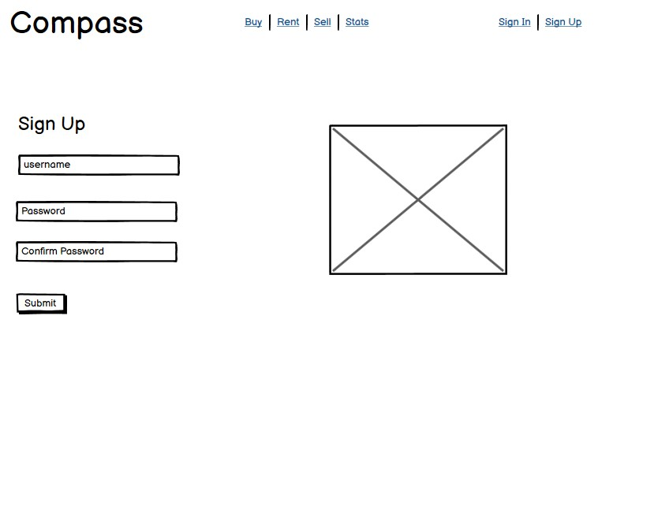

 <h1 align="center">  Compass</h1>

[View the live project here](https://compass-real-estate.herokuapp.com/)

Compass is a social media type property listing site. You can list your property for sale or for rent. You can create a profile and save property listings that you like. Create your own listing of a property that you want to rent or sell. You can send call back requests to the property listing owners to get more information or request a viewing. Edit your listing or delete it when you have sold you property. Update your profile details and your profile image. Our listing page has a search feature for you to search according to area, price, bedrooms or type of property. Separate sections for rental properties and for sale properties and messages displayed on your profile page for you to manage your call backs. Everything you need in one place to sell your property!

## Index – Table of Contents
* [User Experience (UX)](#user-experience-ux) 
* [Features](#features)
* [Design](#design)
* [API](#api)
* [Technologies Used](#technologies-used)
* [Testing](#testing)
* [Deployment](#deployment)
* [Credits](#credits)

## User Experience (UX)

### User stories :

* US01:Display purpose of application through UI
  - As a **Site User** I can **view the landing page** so that **I can determine the purpose of the application**
* US02: Navigate site
  - As a **Site User** I can **navigate using the navigation links** so that **I can easily access application functionality**
* US03: View Listings
  - As a **Site User** I can **view the listings** so that **I can see the properties for sale and all their details**
* US04: Register/Login
  - As a **Site User** I can **register** so that **they can have access to the listings create from and the call back features**
* US05: Make a listing
  - As a **Site User** I can **make a listing** so that **I can advertise a property for sale or rent**
* US06: Save a listing
  - As a **Site User** I can **save a listing** so that **I can keep all the listings I like in one place**
* US07: Delete a Saved listing
  - As a **Site User** I can **delete a saved listing** so that **I can manage my saved listings**
* US08: Edit my Listings
  - As a **Site User** I can **edit my listings** so that **I can keep my listings up to date with information and new photos**
* US09: Delete my Listing
  - As a **Site User** I can **delete my listing** so that **I can remove my listing if I choose to no longer advertise a property**
* US10: Edit my Profile
  - As a **Site User** I can **edit my profile** so that **I can remove a photo or add a new one, or change my name**
* US11: Request a Call back
  - As a **Site User** I can **request a call back** so that **I can get more info or book a viewing**
* US12: View Rentals
  - As a **Sit User** I can **view rentals** so that **I can be sure all the properties I am viewing is only rentals**
* US13: View properties for sale
  - As a **Site User** I can **navigate to properties that is for sale** so that **I can have access to only for sale properties**
* US14: Search
  - As a **Site User** I can **have access to a search feature** so that **I can only see the properties I want to see**
* US15: Messages
  - As a **Site User** I can **view all the messages that was sent to me** so that **I can manage the call backs**

## Features

### Existing Features

-   __F01 Langing Page__
    
    The navigation bar has a consistent look and placement each page supporting easy and intuitive navigation.  It includes a Logo, and a link to the Home page.The navigation has a Home, Buy, Sell and Rent link. If the user is not signed in then links are available to Sign Up and Sign in pages. Once the User signs in the sign up/sign in is replaced by a Saved, Sign Out and Profile link.  If the user is not signed in he/she can browse the rental and for sale properties. The Sell link will redirect the user to the sign in page is on signed in.
    The navigation indicates on which page you are by underlining the link you are currently at. The navigation is displayed on each page with the Logo and Heading. The landing page has a carousel that displays 3 images of homes. Each image has a link to the various Buy, Sell or Rent Links
    
    
    
    

-   __F02 Buy Page__
    
    The Buy page displays all the properties on cards and gives you a quick overview of the property. Twelve cards are displayed and the page is paginated and shows the page number at the bottom of the page with navigation. The buy page only displays properties for sale. At the top of the page is a search feature to search the properties according to are, price, bedrooms or property type. You can use one search feature or all of them and the search is not case sensitive. The listing cards have a link on each of the cards that navigates to the listing page

    
    
    

-   __F03 Listing Detail__
    
    The Link on the listing cards in the Rent and Buy pages navigates you to a listing detail page. A carousel displays the images of the property on the left with the property information on the right. The page is fully responsive and will display the carousel on the top and the info at the bottom on smaller screens. The carousel has button to move to the next image or the previous image. Registered users can access a call back form if they want to book a viewing or request extra info. The property can be saved by clicking on the save icon and it will appear in your saved items. If the user is the owner of the property listing a icon will appear that you can click on to edit or delete the listing. The Edit icon will redirect the user to a edit listing page. The edit listing page is similar to the listing create form but the information is pre-populated in the form. If you have saved a listing the saved icon (a tick)will display at the bottom, if you want to delete the saved property you can click on the tick and the save icon will appear again 

    
    
    
    
    
    
    

-   __F04 Sell Page__
    
    The Sell page can only be accessed by a registered user. If a user is not signed in it will redirect you to the sign in page. The sell page has a from to complete for listing a property. Once the form is completed and submitted the page will redirect to the listing. Error messages will appear if any mistakes were made 

    
    
    

-   __F05 Rent Page__
    
    The Rent page is similar to the buy page. It features a search function at the top for searching properties.
    It only displays properties for rent. The properties is displayed on cards and twelve is displayed per page and it is paginated with the pagination navigation at hte bottom of the page.

    
    

-   __F06 Sign In Page__
    
    The Sign In page has a simple from for username and password to sign in. The username is not case sensitive but he password is. User will be directed to the sign in page if not signed in and wanting to access the sell page. Once the user has signed it he/she will be redirected to the home page.

    
    
   

-   __F07 Sign Up Page__
    
    The Sign Up page has a from with username, password and confirm password. All fields must be completed to register user. Error messages will display if necessary. Users will be redirected to the sign in page once registered

    
    
    

-   __F08 Saved Page__
    
    The saved page icon will appear in the navbar once the user is logged in. If a user saves a listing, rental or for sale , it will appear in the saved page. The saved page is similar to the the buy and sell pages with a search feature at the top to filter your saved properties. The properties will display on cards with links to the properties details. If you have more than 12 saved properties it will be paginated with the pagination navigation at the bottom of the page.

    
   

-   __F09 Sign Out__
    
    The sign out icon will sign the user out and redirect him/her to the home page

-   __F10 Profile Page__
    
    The Profile page has a card with all the users information on it. The card has two links. A edit link that redirects the user to the edit profile page. the edit profile page is pre populate with the users profile information and can be edited. If the user submits the updated details he/she will be redirected to the profile page. The profile page displays all the call back requests for the users on the left. Each message also has a link to the listing in question.

    The second link on the profile card directs the user to all the listings that belongs to the user.The saved page is similar to the the buy and sell pages with a search feature at the top to filter your saved properties. The properties will display on cards with links to the properties details. If you have more than 12 saved properties it will be paginated with the pagination navigation at the bottom of the page.

    
    
    

### Features which could be implemented in the future

-   __Social login__
    
    Add login by using social accounts

-   __Listing likes__
    
    Implement function for users to like listings
-   __Follow User__
    
    Implementing a follow function to follow a user and keep up to date on all the properties on their profile
-  __Blog__
  
    Blog on all the properties trends and property news

## Design

-   ### Wireframes

Balsamiq was used to create the wire frames for the project and was used as a guide for the project

## API
- ### API

- Compass DRF was used in this project. It was designed for the use of this project
- API site https://compass-drf.herokuapp.com/
- Github https://github.com/louwJohan/compass-drf

## Technologies Used

### Languages Used

-   [HTML5](https://en.wikipedia.org/wiki/HTML5)
-   [CSS3](https://en.wikipedia.org/wiki/Cascading_Style_Sheets)
-   [JavaScript](https://www.javascript.com/)
-   [Python](https://www.python.org/)

### Frameworks, Libraries & Programs Used

-   [Google Fonts:](https://fonts.google.com/) used for the Roboto font
-   [Font Awesome:](https://fontawesome.com/) was used to add icons for aesthetic and UX purposes.
-   [Git:](https://git-scm.com/) was used for version control by utilising the Gitpod terminal to commit to Git and Push to GitHub.
-   [GitHub:](https://github.com/) is used as the respository for the project code after being pushed from Git. In addition, for this project GitHub was used for the agile development aspect through the use of User Stories (GitHub Issues) and tracking them on a Kanban board.
-   [Balsamiq:](https://balsamiq.com/) was used to create the wireframes during the design process.
-   [Django Rest Framework](https://www.django-rest-framework.org/) was used for the backend of the project
-   [React Bootstrap](https://react-bootstrap.github.io/) was used to build responsive web pages
-   [Gunicorn](https://gunicorn.org/) was used as the Web Server to run Django on Heroku
-   [dj_database_url](https://pypi.org/project/dj-database-url/) library used to allow database urls to connect to the postgres db
-   [Cloudinary](https://cloudinary.com/) used to store the images used by the application
-   [Django allauth](https://django-allauth.readthedocs.io/en/latest/index.html) used for account registration and authentication
-   [React.js](https://reactjs.org/) used for the front end of the project.

## Testing 

### Automated Testing

React testing suite was used for testing the components. Mock service worker was install to mock the api calls.
The Following tests were written
- Test to display home page
- Test to display all the listings for sale
- Test to display changes in navbar for logged in users and unauthorized users 
- Test to display profile page
- Test to display create listing form
- Test to display sign in form
- Test to display sign out form
All tests that were written has passed.

### Browser Compatibility

- Chrome DevTools was used to test the responsiveness of the application on different screen sizes.
- Application was also tested on Microsoft Edge browser and on Safari on a Iphone
 
    
### Manual Testing Test Cases and Results

- The application was on various browsers and all features was tested the profile update, listing update, listing create, saving a listing , signing up and signing in. 

### Known bugs

- Currently no known bugs.

## Deployment

### How to Clone the Repository 

- Go to the repository on GitHub https://github.com/louwJohan/compass
- Click the "Code" button to the right of the screen, click HTTPs and copy the link there
- Open a GitBash terminal and navigate to the directory where you want to locate the clone
- On the command line, type "git clone" then paste in the copied url and press the Enter key to begin the clone process
- To install the packages required by the application use the command : pip install -r requirements.txt
- When developing and running the application locally set DEBUG=True in the settings.py file
- Changes made to the local clone can be pushed back to the repository using the following commands :

  - git add *filenames*  (or "." to add all changed files)
  - git commit -m *"text message describing changes"*
  - git push

- N.B. Any changes pushed to the master branch will take effect on the live project once the application is re-deployed from Heroku

### Connect the Heroku app to the GitHub repository
- Go to the Application Configuration page for the application on Heroku and click on the Deploy tab.
- Select GitHub as the Deployment Method and if prompted, confirm that you want to connect to GitHub. Enter the name of the github repository (the one used for this project is (https://github.com/louwJohan/compass) and click on Connect to link up the Heroku app to the GitHub repository code.
- Scroll down the page and choose to either Automatically Deploy each time changes are pushed to GitHub, or Manually deploy - for this project Manual Deploy was selected.
- The application can be run from the Application Configuration page by clicking on the Open App button.
- The live link for this project is (https://compass-real-estate.herokuapp.com/)

### Final Deployment steps
In your package.json file, you're going to make the following changes to your scripts property
1. Add a prebuild command for Heroku that will run the start script:
"heroku-prebuild": "npm install -g serve"
2. Add a script command that will create and run the development version:
"dev": "react-scripts start"
3. The next thing to do is to modify the start command with:
"start": "serve -s build"
What this means, is that the app will now run in production and, then, when you are working in gitpod, you will use the following command, in place of npm start:
npm run dev
so final script should look like:
"scripts": {
"heroku-prebuild": "npm install -g serve",
"dev": "react-scripts start",
"start": "serve -s build",
"build": "react-scripts build",
"test": "react-scripts test",
"eject": "react-scripts eject"
},
4. Push to heroku / github

## Credits 

### Code 
- Code was used from the Moments code along  

### Media 
- The Roboto font used was imported from [Google Fonts](https://fonts.google.com/)
- Fontawesome was used for icons [Font Awesome](https://fontawesome.com/)
- Pexels.com was used for all the images[Pexels](https://www.pexels.com/)
  
